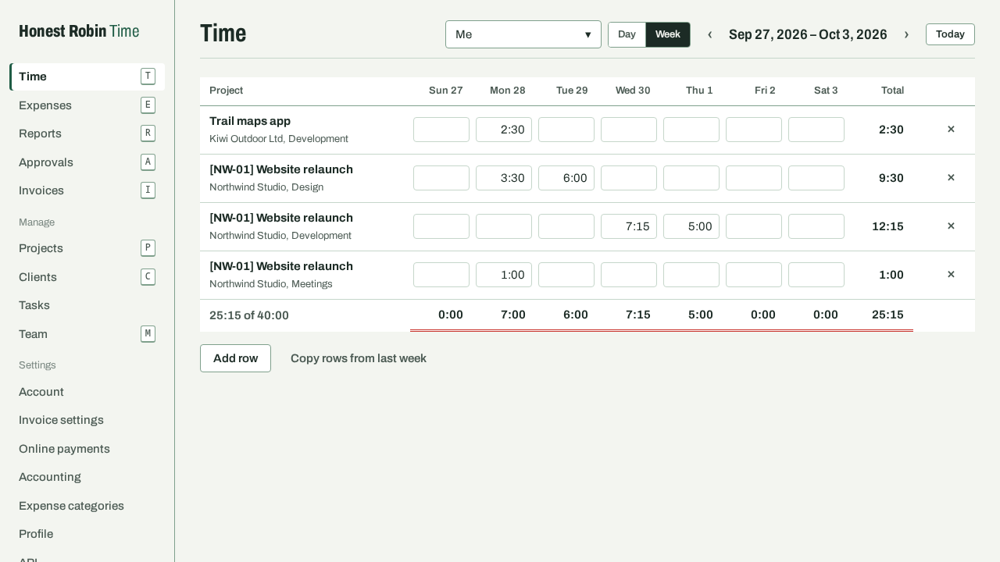
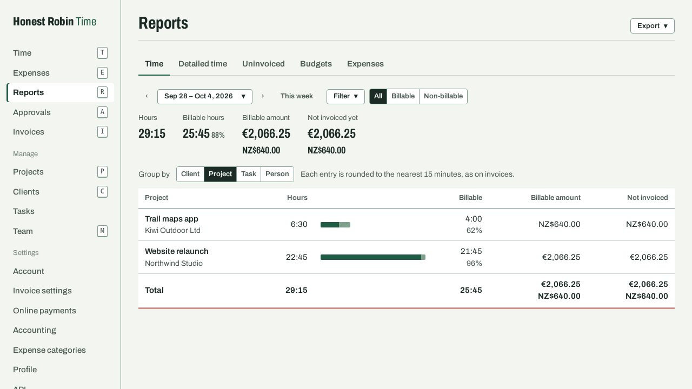
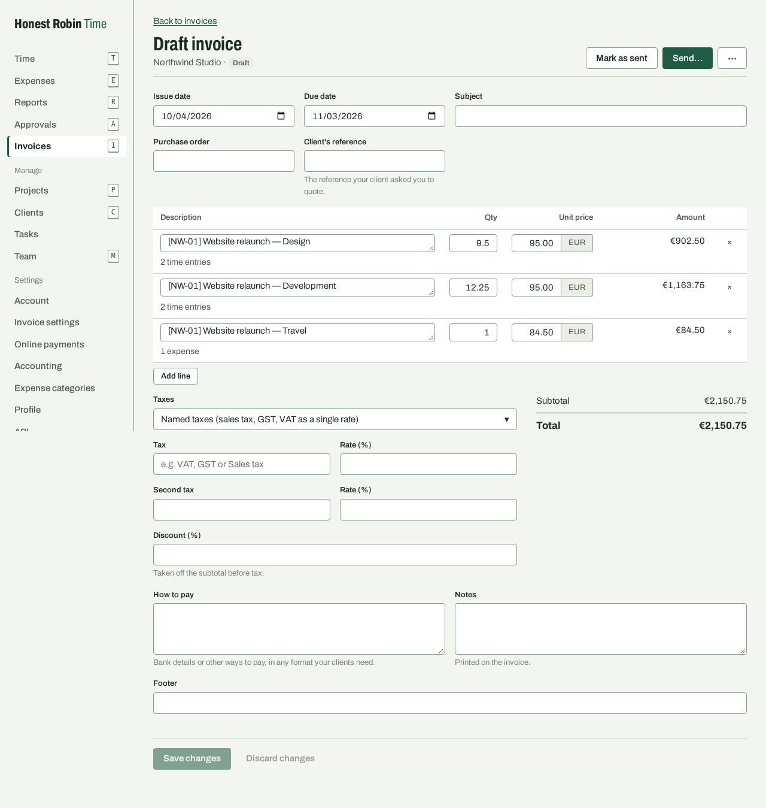

# Honest Robin: Time

Open-source time tracking and invoicing for freelancers and agencies. It works the way people who
come from Harvest expect, moves your Harvest account over in minutes, and has e-invoicing built in.
Run it on your own server, or use Honest Robin Cloud (coming later). It's one of the
[Honest Robin](https://honestrobin.com) products: a joy to use, honest, and you come first.

> **Not released yet.** Version 1 is feature-complete and being tried out before a first release.
> See the [roadmap](ROADMAP.md) for what's built and what's still to check.



## Built by an AI, in the open

Honest Robin: Time is the first Honest Robin product, and it shows how they're made: by an AI,
given a clear brief and good habits. The code, tests and documentation were written by **Claude**
(Anthropic's model, working in [Claude Code](https://claude.com/claude-code)). A human maintainer
wrote the [product specification](docs/spec.md), made the product decisions and kept it on course.
Version 1 took four days.

Nothing about that is hidden:

- **Every commit Claude wrote** says so, in a co-author line. The only others are automatic
  dependency updates. The first commit gathers the four days it took to build version 1; the work
  since is in the history, change by change.
- **Every decision** someone might question is written down in [`docs/decisions/`](docs/decisions/),
  with the reasoning and what was left open.
- **The code is tested.** About 40,000 lines of Kotlin, TypeScript and SQL, covered by around 190
  backend tests in two editions, frontend and extension tests, and end-to-end tests that run the
  packaged app and the browser extension in a real browser. Import totals are checked against
  Harvest's own reports (so far with a stand-in for Harvest's API, not a real account), and
  e-invoices against the official validation rules.

No person has read the code yet, and it hasn't had an independent security audit, so treat it as
pre-release software: try it with made-up data, and don't run your business on it yet. 40,000
lines of code is a liability and not an achievement.

One person can't review every line, and we won't pretend otherwise. Before a release the
maintainer, who knows the architecture, tests the product and reviews samples of the code. AI
agents make most of the corrections and check our claims against the facts, and he signs off what
he sampled. Reports of anything that looks wrong are very welcome; see [SECURITY.md](SECURITY.md).

## What it does

- **Track time** with timers or day and week timesheets; approvals lock submitted weeks; budgets warn you before they run out.
- **Invoice** from tracked time and expenses, with gapless numbering, taxes or VAT, PDFs, reminders, and online payment through your own Stripe account (no fee from us).
- **E-invoicing:** Factur-X/ZUGFeRD, XRechnung and Peppol BIS, sent over Peppol if you like; invoices and payments can go to QuickBooks Online or Xero.
- **Move from Harvest** with one token: people, clients, projects, rates, time, expenses and invoices, checked total by total against Harvest. A CSV import works offline.
- **Reports** for time, uninvoiced work, budgets and expenses, exported to CSV or Excel.
- **A browser extension** (Chrome, Firefox) with a timer and a "Track time" button on Jira, Asana, GitHub, Linear and Trello.
- **Your data stays yours:** a full export on every plan and in every state, a public REST API, and two-factor sign-in.

<p>
  
  
</p>

## Our promises

What we promise, and what holds us to it:

1. **No usage-based pricing.** Nothing is metered for billing. Honest Robin Cloud limits seats only, and the self-hosted edition has no limits.
2. **Export always works,** including on free and lapsed accounts.
3. **The self-hosted edition is complete:** the same code with the same features. A test fails if the editions differ.
4. **No dark patterns:** no hidden fees, no forced annual plans, and you cancel in the app.

The first three are guarded by tests, so they can't break by accident. Code can't stop us breaking
a promise on purpose, though, so all four will also go into the terms of service. And the last
guarantee is yours: you can export everything and run the same software yourself.

They sit on top of the [Robin's Code](https://honestrobin.com/code), the promises every Honest
Robin product is measured against. It's a draft until it's in the terms of service.

## Run it yourself

You need Docker. The only other dependency, PostgreSQL 18, comes with it.

```sh
git clone https://github.com/honestrobin/time.git
cd time
docker compose -f deploy/docker-compose.yml up -d
```

Open http://localhost:8080. The first person to sign up becomes the admin, with the setup code the
app writes to its log (`docker compose -f deploy/docker-compose.yml logs app | grep "setup code"`),
so nobody else can claim a new instance. Everyone else joins by invitation. To run it on your own domain with HTTPS, and for settings, backups and upgrades, see
[docs/self-host.md](docs/self-host.md).

## Develop

You need JDK 25 (Gradle can download it), Node 24 with pnpm, and Docker or Podman for the test database.

```sh
pnpm install
./gradlew :backend:test                  # backend tests (Testcontainers)
./gradlew :backend:bootRun               # needs a Postgres: see docs/development.md
pnpm --filter @honestrobin/web dev       # the web app on :5173
```

| Path | What |
|---|---|
| `backend/` | Kotlin, Spring Boot 4, jOOQ, Flyway, PostgreSQL with row-level security |
| `frontend/` | React and TypeScript web app |
| `extension/` | Browser extension for Chrome and Firefox |
| `packages/api-client/` | TypeScript client generated from the OpenAPI document |
| `deploy/` | Dockerfile, Docker Compose and an HTTPS setup with Caddy |
| `docs/` | Specification, decision records, design philosophy (`design.md`), self-hosting guide, API docs |
| `e2e/` | Playwright end-to-end tests |

Read [CONTRIBUTING.md](CONTRIBUTING.md) before opening a pull request.

## License and trademarks

The code is licensed under the [GNU AGPL v3](LICENSE), with no contributor licence agreement. The
name and the robin are not part of the licence; [TRADEMARKS.md](TRADEMARKS.md) says what's fine.

Claude, Anthropic, Harvest, Jira, Trello, Asana, GitHub, Linear, QuickBooks, Xero, Stripe, Paddle,
Storecove, Peppol and other names mentioned here are trademarks of their respective owners.
Honest Robin is not affiliated with or endorsed by any of them; they're named only to say what it
works with or was built with.
