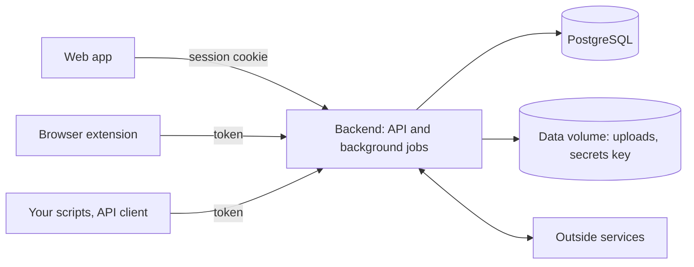

# How Time is built

A one-page tour, for anyone who wants the shape before the code. The details are in the
[specification](spec.md), and the reasons in the [decision records](decisions/).

## What Time is made of

- **The backend** (`backend/`): one Kotlin and Spring Boot application
  ([0018](decisions/0018-spring-boot-4.md)). It serves the API, the web app and the public invoice
  pages, and runs the background jobs. Its modules are packages: `time`, `expenses`, `approvals`,
  `budgets`, `catalog` (clients, projects, tasks, rates), `reports`; `invoicing`, `einvoice`,
  `payments` (Stripe), `accounting` (QuickBooks, Xero), `billing` (Paddle); `auth`, `accounts`,
  `importers` (Harvest, CSV), `export`, `files`, `audit`, `notifications`, `analytics` (PostHog);
  and `platform`: database context, security, mail, encryption, live updates, the edition switch.
- **The web app** (`frontend/`): React and TypeScript, on the same API as everyone else
  ([0005](decisions/0005-api-conventions.md)).
- **The browser extension** (`extension/`): Chrome and Firefox. A timer, and a "Track time" button
  on five sites ([0016](decisions/0016-browser-extension.md)).
- **The API client** (`packages/api-client/`): generated from the backend's OpenAPI document; MIT
  ([0019](decisions/0019-api-client-mit.md)).

## Two editions, one build

`HONESTROBIN_EDITION` is `selfhost` or `cloud`, and every feature is in both. Only `billing`
(Paddle), `analytics` (PostHog) and `platform.edition` (marketing links, credentials Honest Robin
operates) may read it: `EditionParityTest` fails otherwise, or if the endpoints differ beyond
paying for Honest Robin Cloud. Who may sign up is a setting ([0004](decisions/0004-signup-mode.md)).

## The database

- **PostgreSQL 18 is the only dependency.** It holds the data, the job queue, the rate limits and
  the live timer notifications.
- **The database keeps accounts apart.** Every account table has `account_id` and a row-level
  security policy. Each transaction runs as the unprivileged role `honestrobin_app`, so the policy
  holds even when the configured user is a superuser. Work across accounts, such as sign-in and
  jobs, has to ask for it ([0002](decisions/0002-tenancy-rls.md)). Since migration V15, keys
  between account tables include `account_id`, so a reference into another account is refused.
- **Migrations and jOOQ.** Flyway runs the migrations at startup. Queries are typed SQL through
  jOOQ, its classes generated from the migrations and committed ([0006](decisions/0006-generated-code-committed.md)).
- **The audit log** is written by a trigger on every business table: who, from which address, and
  each changed column before and after, secrets left out. The application's role can't change or
  delete audit rows ([0003](decisions/0003-audit-by-trigger.md)).

## How a request flows

1. **Sign-in:** a password (argon2id), a link by email or an invitation, then two-factor where
   it's on. Sensitive steps, such as payment settings and Move out, ask for a recent sign-in.
2. **Sessions and tokens:** the web app keeps a session in an HttpOnly cookie and sends a CSRF
   token with every change. Scripts and the extension use personal access tokens, read-only or
   read-write, each tied to one account. The database keeps only hashes of both.
3. **The account context:** a person can belong to several accounts; each request names one in
   the `HonestRobin-Account-Id` header, and the auth filter checks the membership. Each
   transaction then sets the account, the person and their address in the database, where
   row-level security and the audit trigger read them.
4. **After the commit,** and only then, mail goes out and open tabs hear that a timer changed.

## Outside services

- **Paddle:** Honest Robin Cloud's own subscriptions; cloud only ([0013](decisions/0013-cloud-billing.md), [0020](decisions/0020-seats-ask-first.md) to [0023](decisions/0023-price-above-lock.md)).
- **Stripe Connect:** clients pay invoices online, straight into the account's own Stripe, with no fee to us.
- **Peppol through Storecove:** e-invoices are made on the server and sent with the account's own Storecove contract ([0014](decisions/0014-einvoicing-and-accounting.md)).
- **QuickBooks Online and Xero:** invoices and payments pushed one way, through a queue that retries.
- **Harvest:** import over its API or from CSV, and an optional sync while a team switches ([0011](decisions/0011-harvest-import.md)).
- **PostHog:** cloud only, in the EU: page views and funnel steps per account ([0015](decisions/0015-product-analytics.md)).
- **Have I Been Pwned:** new passwords are checked without being sent; self-hosters can turn it off.
- **Mail:** any SMTP server ([0012](decisions/0012-outbound-mail.md)). Every company the code can reach is in [companies.md](companies.md).

## Background jobs

They run inside the app through db-scheduler, which keeps them in PostgreSQL: they survive a
restart, and each runs once however many app servers there are.

| Job | When | What it does |
|---|---|---|
| Seat sync (cloud) | every 15 minutes | Sends seat counts to Paddle. An ended subscription beyond the free plan turns the account read-only, until it's within the plan again |
| Reminders | every 15 minutes, hourly | Timesheet and invoice reminders, off until someone turns them on |
| Import | once per import; every 15 minutes while syncing | Harvest import in resumable phases, then the sync window |
| Accounting sync | every minute | Pushes queued invoices and payments, with retries |
| Export | once per export | Builds the zip |
| Deletion purge | hourly | Removes exports after 7 days, and accounts 14 days after deletion was asked, ending our access at Stripe, Paddle, QuickBooks, Xero and Storecove |
| Clean-up | every 6 hours | Expired sessions, device codes, sign-in links and rate-limit records |

## Export, import and Move out

An export is one zip ([export-format.md](export-format.md)): every table as JSON, read in one
snapshot, with CSVs, the uploads, and every invoice as a PDF and, where it has the data, as
e-invoices. Those invoice files are drawn from today's data, not kept as they were sent. A test
fails when a table is neither exported nor left out on purpose, and the zip imports into a fresh
account on any instance. **Move out** (Settings → Account) is one button on every plan and in
every state: the zip, where you can go next, and what's still connected with how to end each. It
changes nothing ([0024](decisions/0024-read-only-can-end-connections.md)).

## How it's built and shipped

- **CI** (`.github/workflows/ci.yml`): sign-offs, licences, generated code up to date, backend
  tests in both editions on a real PostgreSQL, web app and extension tests, then end-to-end tests
  on the Compose setup in both editions, which fail on any error in the app's log. When all pass
  on `main`, CI publishes the image (Java 25, non-root) for amd64 and arm64. A version tag releases
  that same image under the version's tags, without building again (`release.yml`); a commit CI
  hasn't published an image for gets no release.
- **Docker Compose:** the app and PostgreSQL, with Caddy for HTTPS ([self-host.md](self-host.md)).
  Honest Robin Cloud runs the same setup on one server in Nuremberg, behind Cloudflare.
- **Backups:** the database dump and the data volume together, since the volume's secrets key
  decrypts stored credentials. Honest Robin Cloud backs up nightly and copies both off the server.

## Where the promises are guarded

[`PROMISES.md`](../PROMISES.md) lists every promise and what keeps it. The main guards are
`RowLevelSecurityTest` and `SecurityRegressionTest` (accounts kept apart), `EditionParityTest`,
`PromiseGuardsTest`, `BillingTest` and `BillingPromisesTest` (price lock, seats, cancelling),
`AccountDataTest`, `MoveOutTest` and `EndConnectionsTest` (export and leaving), `CompanyListTest`
and `NoMailToBringYouBackTest`. A test the ledger names is never weakened to make a check pass.
